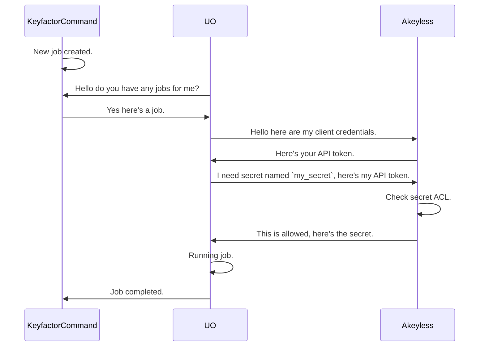
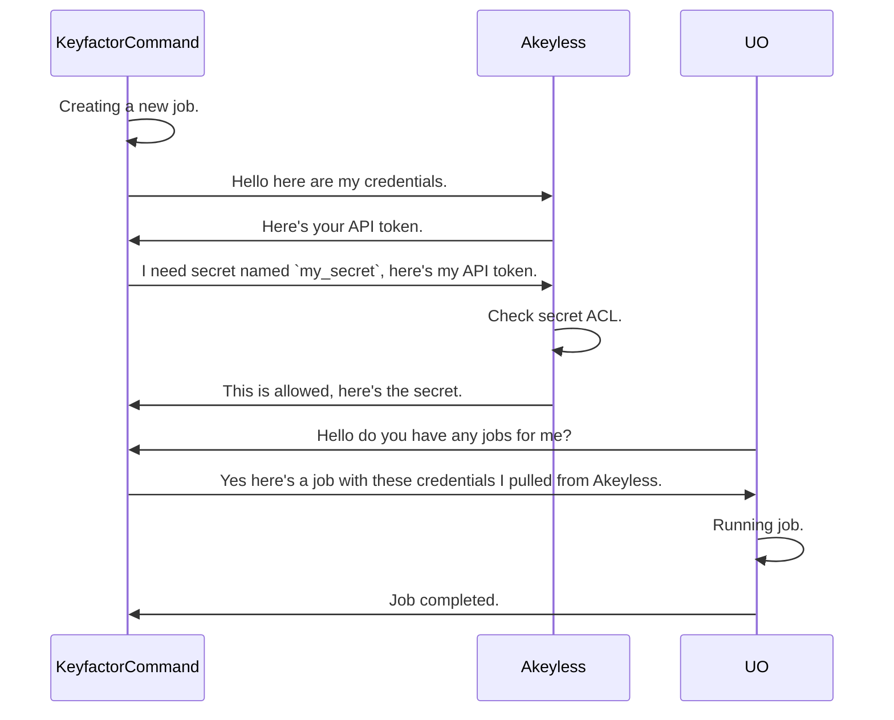

<h1 align="center" style="border-bottom: none">
    Akeyless PAM Provider
</h1>

<p align="center">
  <!-- Badges -->

<a href="https://github.com/Keyfactor/akeyless-pam/releases"></a>


</p>

<p align="center">
  <!-- TOC -->
  <a href="#support">
    <b>Support</b>
  </a>
  ·
  <a href="#getting-started">
    <b>Installation</b>
  </a>
  ·
  <a href="#license">
    <b>License</b>
  </a>
  ·
  <a href="https://github.com/orgs/Keyfactor/repositories?q=pam">
    <b>Related Integrations</b>
  </a>
</p>

## Overview

The Akeyless PAM Provider allows for the retrieval of stored account credentials from an Akeyless secret.

## Support
The Akeyless PAM Provider is supported by Keyfactor for Keyfactor customers. If you have a support issue, please open a support ticket via the Keyfactor Support Portal at https://support.keyfactor.com.

> To report a problem or suggest a new feature, use the **[Issues](../../issues)** tab. If you want to contribute actual bug fixes or proposed enhancements, use the **[Pull requests](../../pulls)** tab.

## Getting Started

The Akeyless PAM Provider is used by Command to resolve PAM-eligible credentials for Universal Orchestrator extensions and for accessing Certificate Authorities. When configured, Command will use the Akeyless PAM Provider to retrieve credentials needed to communicate with the target system. There are two ways to install the Akeyless PAM Provider, and you may elect to use one or both methods:

1. **Locally on the Keyfactor Command server**: PAM credential resolution via the Akeyless PAM Provider will occur on the Keyfactor Command server each time an elegible credential is needed.
2. **Remotely On Universal Orchestrators**: When Jobs are dispatched to Universal Orchestrators, the associated Certificate Store extension assembly will use the Akeyless PAM Provider to resolve eligible PAM credentials.

Before proceeding with installation, you should consider which pattern is best for your requirements and use case.

### Installation

> [!IMPORTANT]
> For the most up-to-date and complete documentation on how to install a PAM provider extension, please visit our [product documentation](https://software.keyfactor.com/Core-OnPrem/Current/Content/ReferenceGuide/Preparing%20Third%20Party%20PAM%20Providers%20to%20Work%20with.htm?Highlight=pam%20provider#InstallingCustomPAMProviderExtensions)


To install Akeyless PAM Provider, it is recommended you install [kfutil](https://github.com/Keyfactor/kfutil). `kfutil` is a command-line tool that simplifies the process of creating PAM Types in Keyfactor Command.


#### Requirements
   - Akeyless credentials w/ permission to access the secret(s) being used. See the [Akeyless documentation](https://docs.akeyless.io/reference/auth) for more information on how to configure the different types of auth.
   - (Optional) `AKEYLESS_API_URL`, `AKEYLESS_AUTH_TYPE`, `AKEYLESS_ACCESS_ID`, and `AKEYLESS_ACCESS_KEY` environment variables can be set on the provider's host process to override the corresponding `manifest.json`/Command portal parameters at runtime. See [Configuration](docs/akeyless.md#configuration) for details and precedence.

#### Create PAM type in Keyfactor Command


##### Using `kfutil`
Create the required PAM Types in the connected Command platform.

```shell
# Akeyless
kfutil pam-types create -r akeyless-pam -n Akeyless
```

##### Using the API
For full API docs please visit our [product documentation](https://software.keyfactor.com/Core-OnPrem/Current/Content/WebAPI/KeyfactorAPI/PAMProvidersPOSTTypes.htm?Highlight=pam%20type)

Below is the payload to `POST` to the Keyfactor Command API
```json
{
  "Name": "Akeyless",
  "Parameters": [
    {
      "Name": "Url",
      "DisplayName": "Akeyless URL",
      "Description": "The URL to the Akeyless instance. Defaults to: https://api.akeyless.io",
      "DataType": 1,
      "InstanceLevel": false
    },
    {
      "Name": "AccessId",
      "DisplayName": "Access ID",
      "Description": "The access key ID used to authenticate to Akeyless using `access_key` authentication.",
      "DataType": 2,
      "InstanceLevel": false
    },
    {
      "Name": "AccessKey",
      "DisplayName": "Access Key",
      "Description": "The access key used to authenticate to Akeyless using `access_key` authentication.",
      "DataType": 2,
      "InstanceLevel": false
    },
    {
      "Name": "AuthType",
      "DisplayName": "Auth Type",
      "Description": "The auth type used to authenticate to the Akeyless platform. Supported types are `access_key`.",
      "DataType": 1,
      "InstanceLevel": false
    },
    {
      "Name": "SecretName",
      "DisplayName": "Secret Name",
      "Description": "The full name (path) of the secret in Akeyless that contains the credential to retrieve.",
      "DataType": 1,
      "InstanceLevel": true
    },
    {
      "Name": "SecretType",
      "DisplayName": "Secret Type",
      "Description": "The type of secret stored in Akeyless. Supported types are `static_kv,static_text,static_json`.",
      "DataType": 1,
      "InstanceLevel": true
    },
    {
      "Name": "StaticSecretFieldName",
      "DisplayName": "Static Secret Field Name",
      "Description": "The field name within a static secret to retrieve the credential from. Required for `static_kv` and optional for `static_json` secret types.",
      "DataType": 1,
      "InstanceLevel": true
    }
  ]
}
```

#### Install PAM provider on Keyfactor Command Host (Local)


1. On the server that hosts Keyfactor Command, download and unzip the latest release of the Akeyless PAM Provider from the [Releases](../../releases) page.

2. Copy the assemblies to the appropriate directories on the Keyfactor Command server:

    <details><summary>Keyfactor Command 11+</summary>

    1. Copy the unzipped assemblies to each of the following directories:

        * `C:\Program Files\Keyfactor\Keyfactor Platform\WebAgentServices\Extensions\akeyless-pam`
        * `C:\Program Files\Keyfactor\Keyfactor Platform\WebConsole\Extensions\akeyless-pam`
        * `C:\Program Files\Keyfactor\Keyfactor Platform\KeyfactorAPI\Extensions\akeyless-pam`

    </details>

    <details><summary>Keyfactor Command 10</summary>

    1. Copy the assemblies to each of the following directories:

        * `C:\Program Files\Keyfactor\Keyfactor Platform\WebAgentServices\bin\akeyless-pam`
        * `C:\Program Files\Keyfactor\Keyfactor Platform\KeyfactorAPI\bin\akeyless-pam`
        * `C:\Program Files\Keyfactor\Keyfactor Platform\WebConsole\bin\akeyless-pam`
        * `C:\Program Files\Keyfactor\Keyfactor Platform\Service\akeyless-pam`

    2. Open a text editor on the Keyfactor Command server as an administrator and open the `web.config` file located in the `WebAgentServices` directory.

    3. In the `web.config` file, locate the `<container> </container>` section and add the following registration:

        ```xml
        <container>
            ...
            <!--The following are PAM Provider registrations. Uncomment them to use them in the Keyfactor Product:-->

            <!--Add the following line exactly to register the PAM Provider-->
            <register type="IPAMProvider" mapTo="Keyfactor.Extensions.Pam.Akeyless, Keyfactor.Command.PAMProviders" name="Akeyless" />
        </container>
        ```

    4. Repeat steps 2 and 3 for each of the directories listed in step 1. The configuration files are located in the following paths by default:

        * `C:\Program Files\Keyfactor\Keyfactor Platform\WebAgentServices\web.config`
        * `C:\Program Files\Keyfactor\Keyfactor Platform\KeyfactorAPI\web.config`
        * `C:\Program Files\Keyfactor\Keyfactor Platform\WebConsole\web.config`
        * `C:\Program Files\Keyfactor\Keyfactor Platform\Service\CMSTimerService.exe.config`

    </details>

3. Restart the Keyfactor Command services (`iisreset`).

#### Install PAM provider on a Universal Orchestrator Host (Remote)


1. Install the Akeyless PAM Provider assemblies.

    * **Using kfutil**: On the server that hosts the Universal Orchestrator, run the following command:

        ```shell
        # Windows Server
        kfutil orchestrator extension -e akeyless-pam@latest --out "C:\Program Files\Keyfactor\Keyfactor Orchestrator\extensions"

        # Linux
        kfutil orchestrator extension -e akeyless-pam@latest --out "/opt/keyfactor/orchestrator/extensions"
        ```

    * **Manually**: Download the latest release of the Akeyless PAM Provider from the [Releases](../../releases) page. Extract the contents of the archive to:

        * **Windows Server**: `C:\Program Files\Keyfactor\Keyfactor Orchestrator\extensions\akeyless-pam`
        * **Linux**: `/opt/keyfactor/orchestrator/extensions/akeyless-pam`

2. Included in the release is a `manifest.json` file that contains the following object:
    ```json
    {
      "Keyfactor:PAMProviders:Akeyless:InitializationInfo": {
        "Url": "<Url>",
        "AccessId": "<AccessId>",
        "AccessKey": "<AccessKey>",
        "AuthType": "<AuthType>"
      }
    }
    ```

    Populate the fields in this object with credentials and configuration data collected in the [requirements](docs/akeyless.md#requirements) section.

3. Restart the Universal Orchestrator service.


### Usage


#### From Keyfactor Command Host (Local)

##### Define a PAM provider in Command
1. In the Keyfactor Command Portal, hover over the ⚙️  (settings) icon in the top right corner of the screen and select **Priviledged Access Management**.

2. Select the **Add** button to create a new PAM provider. Click the dropdown for **Provider Type** and select **Akeyless**.

> [!IMPORTANT]
> If you're running Keyfactor Command 11+, make sure `Remote Provider` is unchecked.

3. Populate the fields with the necessary information collected in the [requirements](docs/akeyless.md#requirements) section:

| Initialization parameter | Display Name | Description |
| --- | --- | --- |
| Url | Akeyless URL | The URL to the Akeyless instance. Defaults to: https://api.akeyless.io |
| AccessId | Access ID | The access key ID used to authenticate to Akeyless using `access_key` authentication. |
| AccessKey | Access Key | The access key used to authenticate to Akeyless using `access_key` authentication. |
| AuthType | Auth Type | The auth type used to authenticate to the Akeyless platform. Supported types are `access_key`. |


4. Click **Save**. The PAM provider is now available for use in Keyfactor Command.

##### Using the PAM provider

Now, when defining Certificate Stores (**Locations**->**Certificate Stores**), **Akeyless** will be available as a PAM provider option. When defining new Certificate Stores, the secret parameter form will display tabs for **Load From Keyfactor Secrets** or **Load From PAM Provider**. 

Select the **Load From PAM Provider** tab, choose the **Akeyless** provider from the list of **Providers**, and populate the fields with the necessary information from the table below:

| Instance parameter | Display Name | Description |
| --- | --- | --- |
| SecretName | Secret Name | The full name (path) of the secret in Akeyless that contains the credential to retrieve. |
| SecretType | Secret Type | The type of secret stored in Akeyless. Supported types are `static_kv,static_text,static_json`. |
| StaticSecretFieldName | Static Secret Field Name | The field name within a static secret to retrieve the credential from. Required for `static_kv` and optional for `static_json` secret types. |


#### From a Universal Orchestrator Host (Remote)


<details><summary>Keyfactor Command 11+</summary>

##### Define a remote PAM provider in Command

In Command 11 and greater, before using the Akeyless PAM type, you must define a Remote PAM Provider in the Command portal.

1. In the Keyfactor Command Portal, hover over the ⚙️  (settings) icon in the top right corner of the screen and select **Priviledged Access Management**.

2. Select the **Add** button to create a new PAM provider.

3. Make sure that `Remote Provider` is checked.

4. Click the dropdown for **Provider Type** and select **Akeyless**. 

5. Give the provider a unique name.

6. Click "Save".

##### Using the PAM provider

When defining Certificate Stores (**Locations**->**Certificate Stores**), **Akeyless** can be used as a PAM provider. When defining a new Certificate Store, the secret parameter form will display tabs for **Load From Keyfactor Secrets** or **Load From PAM Provider**.

Select the **Load From PAM Provider** tab, choose the **Akeyless** provider from the list of **Providers**, and populate the fields with the necessary information from the table below:

| Instance parameter | Display Name | Description |
| --- | --- | --- |
| SecretName | Secret Name | The full name (path) of the secret in Akeyless that contains the credential to retrieve. |
| SecretType | Secret Type | The type of secret stored in Akeyless. Supported types are `static_kv,static_text,static_json`. |
| StaticSecretFieldName | Static Secret Field Name | The field name within a static secret to retrieve the credential from. Required for `static_kv` and optional for `static_json` secret types. |


</details>

<details><summary>Keyfactor Command 10</summary>

When defining Certificate Stores (**Locations**->**Certificate Stores**), **Akeyless** can be used as a PAM provider.

When entering Secret fields, select the **Load From Keyfactor Secrets** tab, and populate the **Secret Value** field with the following JSON object:

```json
{"SecretName":"The full name (path) of the secret in Akeyless that contains the credential to retrieve.","SecretType":"The type of secret stored in Akeyless. Supported types are `static_kv,static_text,static_json`.","StaticSecretFieldName":"The field name within a static secret to retrieve the credential from. Required for `static_kv` and optional for `static_json` secret types."}

```

> We recommend creating this JSON object in a text editor, and copying it into the Secret Value field.

</details>


> [!NOTE]
> Additional information on Akeyless can be found in the [supplemental documentation](docs/akeyless.md).

#### Extension Mechanics

When configuring Akeyless for use as a PAM Provider with Keyfactor, you will need to ensure that your
instance is configured for API access using the desired auth method. This can be done by an Akeyless administrator.
For more details visit the vendor
docs [here](https://docs.akeyless.io/docs/access-and-authentication-methods).

Once API access is configured the credential *MUST* be granted access to view secret(s) you'll be using.

### Akeyless API Endpoints Used

The provider calls exactly two Akeyless REST API endpoints, both against the configured base URL (default `https://api.akeyless.io`, see the `Url` initialization parameter / `AKEYLESS_API_URL` environment variable above):

| Endpoint | Method | Called from | Purpose |
|---|---|---|---|
| [`/auth`](https://docs.akeyless.io/reference/auth) | `POST` | `AkeylessApiClient.Authenticate` (invoked once per `GetPassword` call, before secret retrieval) | Exchanges the configured `AccessId`/`AccessKey` for a short-lived auth token. |
| [`/get-secret-value`](https://docs.akeyless.io/reference/getsecretvalue) | `POST` | `AkeylessApiClient.GetSecretValuesAsync` (invoked once per `GetPassword` call, after authentication) | Retrieves the value of the secret named by the `SecretName` instance parameter, using the token from `/auth`. |

No other Akeyless API endpoints are called by this provider — it only ever authenticates and reads a single static secret value per credential lookup. It never creates, updates, deletes, or lists items in Akeyless.

### Granting an Auth Method Access to a Secret

In Akeyless, access is controlled through **Access Roles**. A role ties one or more auth methods to a set of permitted item paths. The steps below show how to grant an API Key auth method read access to a secret using the Akeyless console.

**1. Create an Access Role** (if one doesn't exist already)

Navigate to **Access Roles** → **New Role**, give it a name (e.g. `keyfactor-pam`), and save.

**2. Associate the Auth Method with the Role**

Open the role, go to the **Auth Methods** tab, and click **Associate**. Select the API Key auth method whose Access ID and Access Key you'll be configuring in Keyfactor.

**3. Add a secret access rule to the Role**

Still in the role, go to the **Access Rules** (or **Items**) tab and click **Add Rule**:

| Field | Value |
|---|---|
| Item path | The full path to your secret, e.g. `/my-org/my-app/db-password`. Wildcards are supported, e.g. `/my-org/my-app/*` |
| Access type | `read` |

Save the rule.

Once the rule is in place, the auth method can authenticate and retrieve any secret that matches the configured path. You can verify access using the Akeyless CLI:

```shell
akeyless auth --access-id <ACCESS_ID> --access-key <ACCESS_KEY>
akeyless get-secret-value --name /my-org/my-app/db-password --token <TOKEN>
```

### Granting an Auth Method Access to a Secret (CLI)

The full service account setup can be scripted using the Akeyless CLI. The `create-auth-method-api-key` command returns the Access ID and Access Key you'll need for the Keyfactor configuration.

```shell
# 1. Create the API Key auth method
#    The response includes the Access ID and Access Key — save these.
akeyless create-auth-method-api-key --name /keyfactor/pam-auth-method

# 2. Create an access role
akeyless create-role --name keyfactor-pam

# 3. Associate the auth method with the role
akeyless assoc-role-auth-method \
  --role-name keyfactor-pam \
  --am-name /keyfactor/pam-auth-method

# 4. Grant the role read access to a secret path (wildcards supported)
akeyless set-role-rule \
  --role-name keyfactor-pam \
  --path "/my-org/my-app/*" \
  --capability read
```

After adding and sharing a secret, you can use the secret's name (the "Secret name") to retrieve credentials from Akeyless as a PAM Provider.

### Running the PAM provider on Keyfactor Universal Orchestrator (UO)

When installing on the Universal Orchestrator (UO), the PAM provider is installed on and run from the UO host. Below is a sequence diagram
showing the flow of the PAM provider when it is run from the UO.



### Running the PAM provider on the Keyfactor Command Host

When installing the PAM provider on the Keyfactor Command Host, it is installed on and run from the Keyfactor Command host.
Below is a sequence diagram showing the flow of the PAM provider when it is run from the Keyfactor Command Host.



## Configuration

Connection and authentication parameters can be set in two ways:

1. **`manifest.json`/Command portal parameters** — set via the `manifest.json` `InitializationInfo` block (Universal Orchestrator installs) or the corresponding fields in the Command portal PAM provider configuration (Command host installs). This is the standard way to configure the provider.
2. **Environment variables** — if set on the host process running the PAM provider (the Keyfactor Command server for local installs, or the Universal Orchestrator host for remote installs), these override whatever value is configured via `manifest.json` or the Command portal. This is useful when connection details need to be controlled at the infrastructure/deployment level rather than baked into provider configuration — for example, pointing different environments (dev/stage/prod) at different Akeyless instances or credentials without changing `manifest.json` or Command PAM provider settings.

| Environment Variable | Overrides | Falls Back To |
|---|---|---|
| `AKEYLESS_API_URL` | `Url` | configured `Url` initialization parameter, then default (`https://api.akeyless.io`) |
| `AKEYLESS_AUTH_TYPE` | `AuthType` | configured `AuthType` initialization parameter |
| `AKEYLESS_ACCESS_ID` | `AccessId` | configured `AccessId` initialization parameter |
| `AKEYLESS_ACCESS_KEY` | `AccessKey` | configured `AccessKey` initialization parameter |

Precedence for each: environment variable (if set to a non-empty, non-whitespace-only value) > configured initialization parameter > default (`Url` only). An environment variable that is unset, or explicitly set to an empty or whitespace-only string, is treated as "not overriding" and falls through to the configured value. When an override is active, the provider logs which environment variable is overriding (never the value), so an incident investigation can confirm whether the effective connection parameter matches Command's recorded configuration.

## Supported Authentication Methods

### Access Key (API Key) Authentication
This method uses an Access Key and Access ID pair to authenticate to the Akeyless API. These credentials can be created in the Akeyless console.
For more information, see the [Akeyless documentation](https://tutorials.akeyless.io/docs/authentication-methods-and-api-key-authentication).

#### Example `manifest.json` configuration:

```json
{
  "extensions": {
    "Keyfactor.Platform.Extensions.IPAMProvider": {
      "PAMProviders.Akeyless.PAMProvider": {
        "assemblyPath": "akeyless-pam.dll",
        "TypeFullName": "Keyfactor.Extensions.Pam.Akeyless.AkeylessPam"
      }
    }
  },
  "Keyfactor:PAMProviders:Akeyless-:InitializationInfo": {
    "Url": "https://api.akeyless.io",
    "AuthType": "access_key",
    "AccessId": "<ACCESS_ID>",
    "AccessKey": "<ACCESS_KEY>"
  }
}
```

## Supported Secret Types
Below are the types of Akeyless secret that are supported by this provider.

### Static Secrets
For full details on static secrets, see the [Akeyless documentation](https://docs.akeyless.io/docs/secret-management/static-secrets).

| Secret Type   | Description                                                                          | Additional Fields                                                                                                                          |
|---------------|--------------------------------------------------------------------------------------|--------------------------------------------------------------------------------------------------------------------------------------------|
| `static_text` | A static secret whose value is returned as a plain string                            | N/A                                                                                                                                        |
| `static_json` | A static secret containing JSON; a specific field can optionally be extracted        | *Optional*: `StaticSecretFieldName`. Use this to parse a specific field value from a JSON secret, else the full JSON blob will be returned |
| `static_kv`   | A static secret containing key-value pairs; a specific field is extracted by name    | *Required*: `StaticSecretFieldName`. Use this to parse a specific field value from a key-value secret. For example `password`.             |

---

#### `static_text`

A static secret whose entire value is a plain string. The value is returned as-is with no parsing.

**Example secret value in Akeyless:**
```
s3cr3tP@ssword!
```

**Example instance parameter configuration:**

| Parameter | Value |
|-----------|-------|
| `SecretName` | `/my-org/my-app/db-password` |
| `SecretType` | `static_text` |

---

#### `static_json`

A static secret whose value is a JSON object. The provider can return either the full JSON blob or a single extracted field.

- If `StaticSecretFieldName` is **omitted**, the full JSON string is returned.
- If `StaticSecretFieldName` is **provided**, only the value of that field is returned.

> **Note:** The Keyfactor Command portal may display `StaticSecretFieldName` as a required field. If you want the full JSON blob returned (no field extraction), enter a single space (` `) in the field — the provider treats whitespace-only values as empty.

**Example secret value in Akeyless:**
```json
{
  "username": "db_user",
  "password": "s3cr3tP@ssword!"
}
```

**Example instance parameter configuration (extract a single field):**

| Parameter | Value |
|-----------|-------|
| `SecretName` | `/my-org/my-app/db-credentials` |
| `SecretType` | `static_json` |
| `StaticSecretFieldName` | `password` |

---

#### `static_kv`

A static secret whose value is a set of key-value pairs, one per line in `key=value` format. A specific field must be named via `StaticSecretFieldName`.

**Example secret value in Akeyless:**
```
username=db_user
password=s3cr3tP@ssword!
host=db.example.com
```

**Example instance parameter configuration:**

| Parameter | Value |
|-----------|-------|
| `SecretName` | `/my-org/my-app/db-credentials` |
| `SecretType` | `static_kv` |
| `StaticSecretFieldName` | `password` |


## License

Apache License 2.0, see [LICENSE](LICENSE)

## Related Integrations

See all [Keyfactor PAM Provider extensions](https://github.com/orgs/Keyfactor/repositories?q=pam).
