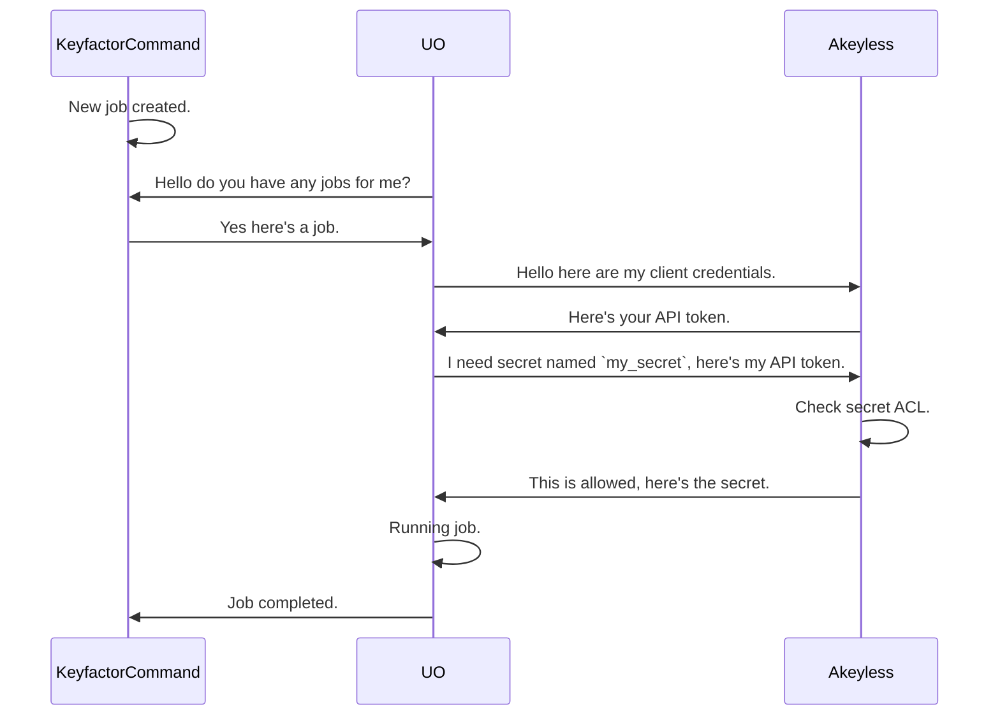
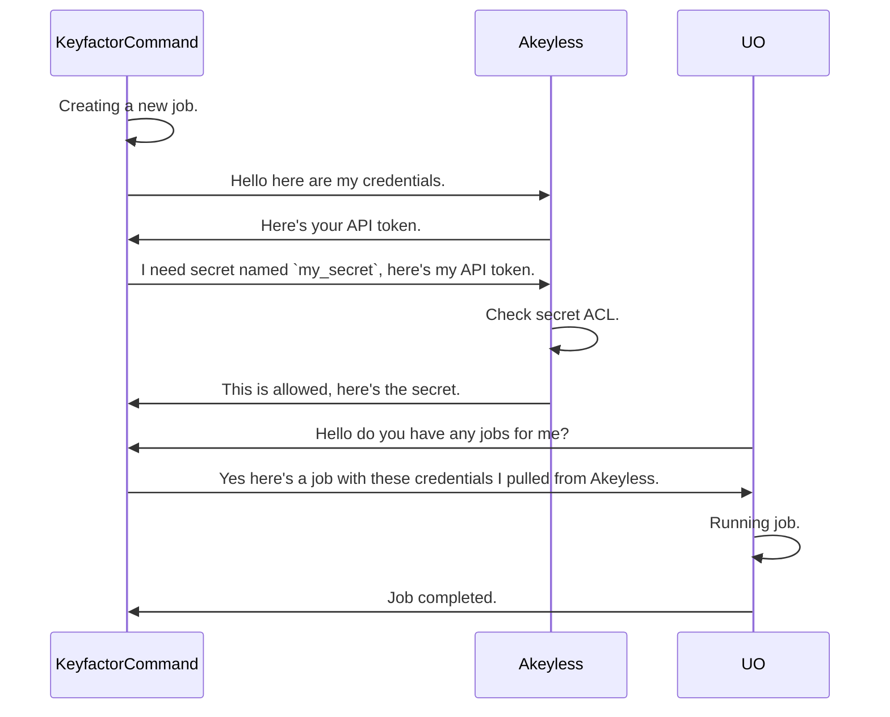

## Akeyless

The Akeyless PAM Provider allows for the retrieval of stored account credentials from an Akeyless secret.
Below you will find a list of supported [auth methods](#supported-authentication-methods) and [secret types](#supported-secret-types) for this provider. For more information on
these authentication methods, see the [Akeyless documentation](https://docs.akeyless.io/reference/auth)

## Requirements

- Akeyless credentials w/ permission to access the secret(s) being used. See the [Akeyless documentation](https://docs.akeyless.io/reference/auth) for more information on how to configure the different types of auth.

## Mechanics

When configuring Akeyless for use as a PAM Provider with Keyfactor, you will need to ensure that your
instance is configured for API access using the desired auth method. This can be done by an Akeyless administrator.
For more details visit the vendor
docs [here](https://docs.akeyless.io/docs/access-and-authentication-methods).

Once API access is configured the credential *MUST* be granted access to view secret(s) you'll be using.

### Granting an Auth Method Access to a Secret

In Akeyless, access is controlled through **Access Roles**. A role ties one or more auth methods to a set of permitted item paths. The steps below show how to grant an API Key auth method read access to a secret using the Akeyless console.

**1. Create an Access Role** (if one doesn't exist already)

Navigate to **Access Roles** → **New Role**, give it a name (e.g. `keyfactor-pam`), and save.

**2. Associate the Auth Method with the Role**

Open the role, go to the **Auth Methods** tab, and click **Associate**. Select the API Key auth method whose Access ID and Access Key you'll be configuring in Keyfactor.

**3. Add a secret access rule to the Role**

Still in the role, go to the **Access Rules** (or **Items**) tab and click **Add Rule**:

| Field | Value |
|---|---|
| Item path | The full path to your secret, e.g. `/my-org/my-app/db-password`. Wildcards are supported, e.g. `/my-org/my-app/*` |
| Access type | `read` |

Save the rule.

Once the rule is in place, the auth method can authenticate and retrieve any secret that matches the configured path. You can verify access using the Akeyless CLI:

```shell
akeyless auth --access-id <ACCESS_ID> --access-key <ACCESS_KEY>
akeyless get-secret-value --name /my-org/my-app/db-password --token <TOKEN>
```

### Granting an Auth Method Access to a Secret (CLI)

The full service account setup can be scripted using the Akeyless CLI. The `create-auth-method-api-key` command returns the Access ID and Access Key you'll need for the Keyfactor configuration.

```shell
# 1. Create the API Key auth method
#    The response includes the Access ID and Access Key — save these.
akeyless create-auth-method-api-key --name /keyfactor/pam-auth-method

# 2. Create an access role
akeyless create-role --name keyfactor-pam

# 3. Associate the auth method with the role
akeyless assoc-role-auth-method \
  --role-name keyfactor-pam \
  --am-name /keyfactor/pam-auth-method

# 4. Grant the role read access to a secret path (wildcards supported)
akeyless set-role-rule \
  --role-name keyfactor-pam \
  --path "/my-org/my-app/*" \
  --capability read
```

After adding and sharing a secret, you can use the secret's name (the "Secret name") to retrieve credentials from Akeyless as a PAM Provider.

### Running the PAM provider on Keyfactor Universal Orchestrator (UO)

When installing on the Universal Orchestrator (UO), the PAM provider is installed on and run from the UO host. Below is a sequence diagram
showing the flow of the PAM provider when it is run from the UO.



### Running the PAM provider on the Keyfactor Command Host

When installing the PAM provider on the Keyfactor Command Host, it is installed on and run from the Keyfactor Command host.
Below is a sequence diagram showing the flow of the PAM provider when it is run from the Keyfactor Command Host.



The Akeyless PAM Provider allows for the retrieval of stored account credentials from an Akeyless secret.
Below you will find a list of supported [auth methods](#supported-authentication-methods) and [secret types](#supported-secret-types) for this provider. For more information on
these authentication methods, see the [Akeyless documentation](https://docs.akeyless.io/reference/auth)

- Akeyless credentials w/ permission to access the secret(s) being used. See the [Akeyless documentation](https://docs.akeyless.io/reference/auth) for more information on how to configure the different types of auth.

## Configuration

Connection and authentication parameters can be set in two ways:

1. **`manifest.json`/Command portal parameters** — set via the `manifest.json` `InitializationInfo` block (Universal Orchestrator installs) or the corresponding fields in the Command portal PAM provider configuration (Command host installs). This is the standard way to configure the provider.
2. **Environment variables** — if set on the host process running the PAM provider (the Keyfactor Command server for local installs, or the Universal Orchestrator host for remote installs), these override whatever value is configured via `manifest.json` or the Command portal. This is useful when connection details need to be controlled at the infrastructure/deployment level rather than baked into provider configuration — for example, pointing different environments (dev/stage/prod) at different Akeyless instances or credentials without changing `manifest.json` or Command PAM provider settings.

| Environment Variable | Overrides | Falls Back To |
|---|---|---|
| `AKEYLESS_API_URL` | `Url` | configured `Url` initialization parameter, then default (`https://api.akeyless.io`) |
| `AKEYLESS_AUTH_TYPE` | `AuthType` | configured `AuthType` initialization parameter |
| `AKEYLESS_ACCESS_ID` | `AccessId` | configured `AccessId` initialization parameter |
| `AKEYLESS_ACCESS_KEY` | `AccessKey` | configured `AccessKey` initialization parameter |

Precedence for each: environment variable (if set to a non-empty value) > configured initialization parameter > default (`Url` only). An environment variable that is unset, or explicitly set to an empty string, is treated as "not overriding" and falls through to the configured value.

## Supported Authentication Methods

### Access Key (API Key) Authentication
This method uses an Access Key and Access ID pair to authenticate to the Akeyless API. These credentials can be created in the Akeyless console.
For more information, see the [Akeyless documentation](https://tutorials.akeyless.io/docs/authentication-methods-and-api-key-authentication).

#### Example `manifest.json` configuration:

```json
{
  "extensions": {
    "Keyfactor.Platform.Extensions.IPAMProvider": {
      "PAMProviders.Akeyless.PAMProvider": {
        "assemblyPath": "akeyless-pam.dll",
        "TypeFullName": "Keyfactor.Extensions.Pam.Akeyless.AkeylessPam"
      }
    }
  },
  "Keyfactor:PAMProviders:Akeyless-:InitializationInfo": {
    "Url": "https://api.akeyless.io",
    "AuthType": "access_key",
    "AccessId": "<ACCESS_ID>",
    "AccessKey": "<ACCESS_KEY>"
  }
}
```

## Supported Secret Types
Below are the types of Akeyless secret that are supported by this provider.

### Static Secrets
For full details on static secrets, see the [Akeyless documentation](https://docs.akeyless.io/docs/secret-management/static-secrets).

| Secret Type   | Description                                                                          | Additional Fields                                                                                                                          |
|---------------|--------------------------------------------------------------------------------------|--------------------------------------------------------------------------------------------------------------------------------------------|
| `static_text` | A static secret whose value is returned as a plain string                            | N/A                                                                                                                                        |
| `static_json` | A static secret containing JSON; a specific field can optionally be extracted        | *Optional*: `StaticSecretFieldName`. Use this to parse a specific field value from a JSON secret, else the full JSON blob will be returned |
| `static_kv`   | A static secret containing key-value pairs; a specific field is extracted by name    | *Required*: `StaticSecretFieldName`. Use this to parse a specific field value from a key-value secret. For example `password`.             |

---

#### `static_text`

A static secret whose entire value is a plain string. The value is returned as-is with no parsing.

**Example secret value in Akeyless:**
```
s3cr3tP@ssword!
```

**Example instance parameter configuration:**

| Parameter | Value |
|-----------|-------|
| `SecretName` | `/my-org/my-app/db-password` |
| `SecretType` | `static_text` |

---

#### `static_json`

A static secret whose value is a JSON object. The provider can return either the full JSON blob or a single extracted field.

- If `StaticSecretFieldName` is **omitted**, the full JSON string is returned.
- If `StaticSecretFieldName` is **provided**, only the value of that field is returned.

> **Note:** The Keyfactor Command portal may display `StaticSecretFieldName` as a required field. If you want the full JSON blob returned (no field extraction), enter a single space (` `) in the field — the provider treats whitespace-only values as empty.

**Example secret value in Akeyless:**
```json
{
  "username": "db_user",
  "password": "s3cr3tP@ssword!"
}
```

**Example instance parameter configuration (extract a single field):**

| Parameter | Value |
|-----------|-------|
| `SecretName` | `/my-org/my-app/db-credentials` |
| `SecretType` | `static_json` |
| `StaticSecretFieldName` | `password` |

---

#### `static_kv`

A static secret whose value is a set of key-value pairs, one per line in `key=value` format. A specific field must be named via `StaticSecretFieldName`.

**Example secret value in Akeyless:**
```
username=db_user
password=s3cr3tP@ssword!
host=db.example.com
```

**Example instance parameter configuration:**

| Parameter | Value |
|-----------|-------|
| `SecretName` | `/my-org/my-app/db-credentials` |
| `SecretType` | `static_kv` |
| `StaticSecretFieldName` | `password` |

When configuring Akeyless for use as a PAM Provider with Keyfactor, you will need to ensure that your
instance is configured for API access using the desired auth method. This can be done by an Akeyless administrator.
For more details visit the vendor
docs [here](https://docs.akeyless.io/docs/access-and-authentication-methods).

Once API access is configured the credential *MUST* be granted access to view secret(s) you'll be using.

### Granting an Auth Method Access to a Secret

In Akeyless, access is controlled through **Access Roles**. A role ties one or more auth methods to a set of permitted item paths. The steps below show how to grant an API Key auth method read access to a secret using the Akeyless console.

**1. Create an Access Role** (if one doesn't exist already)

Navigate to **Access Roles** → **New Role**, give it a name (e.g. `keyfactor-pam`), and save.

**2. Associate the Auth Method with the Role**

Open the role, go to the **Auth Methods** tab, and click **Associate**. Select the API Key auth method whose Access ID and Access Key you'll be configuring in Keyfactor.

**3. Add a secret access rule to the Role**

Still in the role, go to the **Access Rules** (or **Items**) tab and click **Add Rule**:

| Field | Value |
|---|---|
| Item path | The full path to your secret, e.g. `/my-org/my-app/db-password`. Wildcards are supported, e.g. `/my-org/my-app/*` |
| Access type | `read` |

Save the rule.

Once the rule is in place, the auth method can authenticate and retrieve any secret that matches the configured path. You can verify access using the Akeyless CLI:

```shell
akeyless auth --access-id <ACCESS_ID> --access-key <ACCESS_KEY>
akeyless get-secret-value --name /my-org/my-app/db-password --token <TOKEN>
```

### Granting an Auth Method Access to a Secret (CLI)

The full service account setup can be scripted using the Akeyless CLI. The `create-auth-method-api-key` command returns the Access ID and Access Key you'll need for the Keyfactor configuration.

```shell
# 1. Create the API Key auth method
#    The response includes the Access ID and Access Key — save these.
akeyless create-auth-method-api-key --name /keyfactor/pam-auth-method

# 2. Create an access role
akeyless create-role --name keyfactor-pam

# 3. Associate the auth method with the role
akeyless assoc-role-auth-method \
  --role-name keyfactor-pam \
  --am-name /keyfactor/pam-auth-method

# 4. Grant the role read access to a secret path (wildcards supported)
akeyless set-role-rule \
  --role-name keyfactor-pam \
  --path "/my-org/my-app/*" \
  --capability read
```

After adding and sharing a secret, you can use the secret's name (the "Secret name") to retrieve credentials from Akeyless as a PAM Provider.

### Running the PAM provider on Keyfactor Universal Orchestrator (UO)

When installing on the Universal Orchestrator (UO), the PAM provider is installed on and run from the UO host. Below is a sequence diagram
showing the flow of the PAM provider when it is run from the UO.


### Running the PAM provider on the Keyfactor Command Host

When installing the PAM provider on the Keyfactor Command Host, it is installed on and run from the Keyfactor Command host.
Below is a sequence diagram showing the flow of the PAM provider when it is run from the Keyfactor Command Host.


