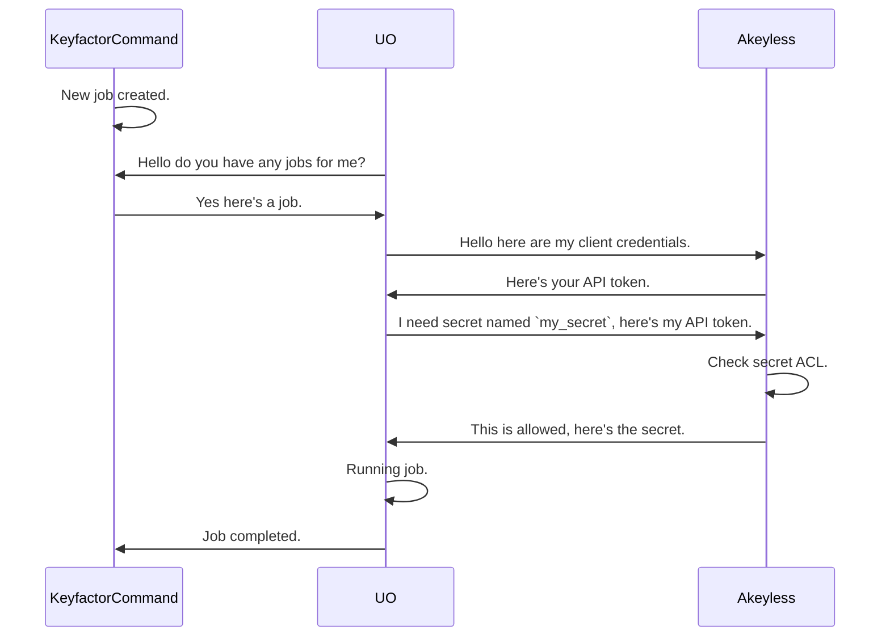
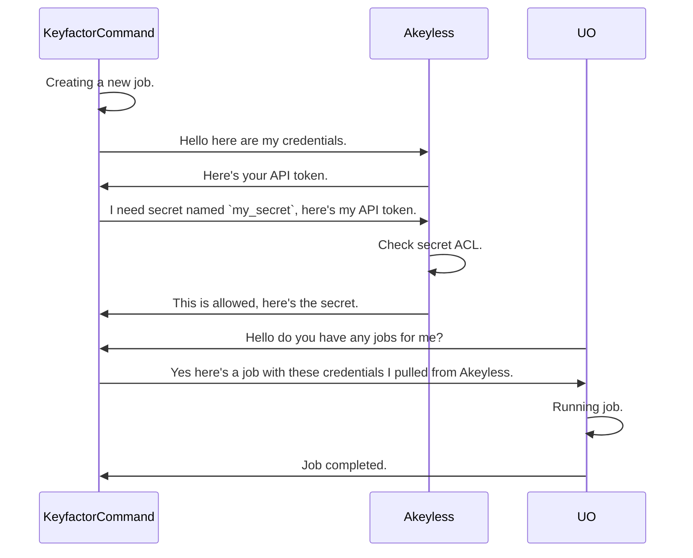

## Overview

The Akeyless PAM Provider allows for the retrieval of stored account credentials from an Akeyless secret.
Below you will find a list of supported [auth methods](#supported-authentication-methods) and [secret types](#supported-secret-types) for this provider. For more information on
these authentication methods, see the [Akeyless documentation](https://docs.akeyless.io/reference/auth)

## Requirements

- Akeyless credentials w/ permission to access the secret(s) being used. See the [Akeyless documentation](https://docs.akeyless.io/reference/auth) for more information on how to configure the different types of auth.

## Supported Authentication Methods

### Access Key (API Key) Authentication
This method uses an Access Key and Access ID pair to authenticate to the Akeyless API. These credentials can be created in the Akeyless console.
For more information, see the [Akeyless documentation](https://tutorials.akeyless.io/docs/authentication-methods-and-api-key-authentication).

#### Example `manifest.json` configuration:

```json
{
  "extensions": {
    "Keyfactor.Platform.Extensions.IPAMProvider": {
      "PAMProviders.Akeyless.PAMProvider": {
        "assemblyPath": "akeyless-pam.dll",
        "TypeFullName": "Keyfactor.Extensions.Pam.Akeyless.AkeylessPam"
      }
    }
  },
  "Keyfactor:PAMProviders:Akeyless-:InitializationInfo": {
    "Url": "https://api.akeyless.io",
    "AuthType": "access_key",
    "AccessId": "<ACCESS_ID>",
    "AccessKey": "<ACCESS_KEY>"
  }
}
```

## Supported Secret Types
Below are the types of Akeyless secret that are supported by this provider.

### Static Secrets
For full details on static secrets, see the [Akeyless documentation](https://docs.akeyless.io/docs/secret-management/static-secrets).

| Secret Type   | Description                                                                          | Additional Fields                                                                                                                          |
|---------------|--------------------------------------------------------------------------------------|--------------------------------------------------------------------------------------------------------------------------------------------|
| `static_text` | A static secret whose value is returned as a plain string                            | N/A                                                                                                                                        |
| `static_json` | A static secret containing JSON; a specific field can optionally be extracted        | *Optional*: `StaticSecretFieldName`. Use this to parse a specific field value from a JSON secret, else the full JSON blob will be returned |
| `static_kv`   | A static secret containing key-value pairs; a specific field is extracted by name    | *Required*: `StaticSecretFieldName`. Use this to parse a specific field value from a key-value secret. For example `password`.             |


## Mechanics

When configuring Akeyless for use as a PAM Provider with Keyfactor, you will need to ensure that your
instance is configured for API access using the desired auth method. This can be done by an Akeyless administrator.
For more details visit the vendor
docs [here](https://docs.akeyless.io/docs/access-and-authentication-methods).

Once API access is configured the credential *MUST* be granted access to view secret(s) you'll be using.

After adding and sharing a secret, you can use the secret's name (the "Secret name") to retrieve credentials from Akeyless as a PAM Provider.

### Running the PAM provider on Keyfactor Universal Orchestrator (UO)

When installing on the Universal Orchestrator (UO), the PAM provider is installed on and run from the UO host. Below is a sequence diagram
showing the flow of the PAM provider when it is run from the UO.



### Running the PAM provider on the Keyfactor Command Host

When installing the PAM provider on the Keyfactor Command Host, it is installed on and run from the Keyfactor Command host.
Below is a sequence diagram showing the flow of the PAM provider when it is run from the Keyfactor Command Host.


